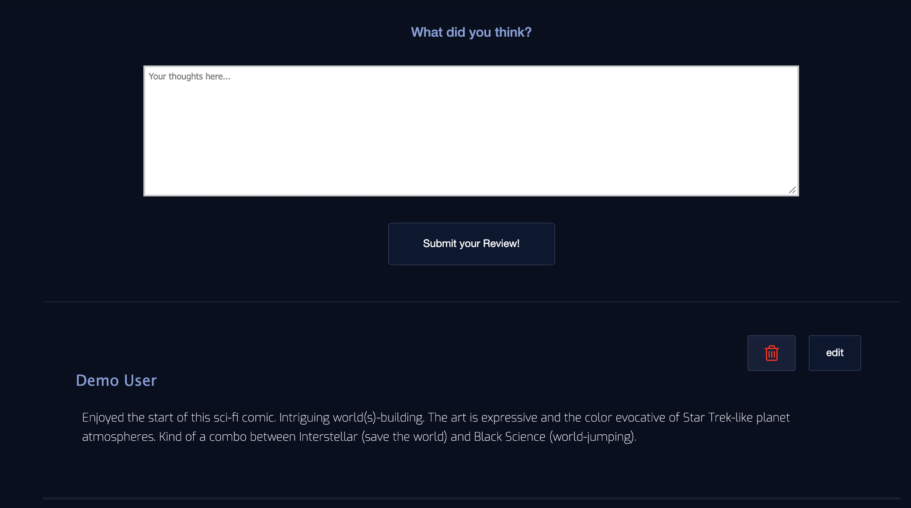

<h1 align="center">Comic-Collection</h1>

<p align="center">See our site hosted on heroku
<br><a href="https://comic-collections.herokuapp.com/">Comic-Collection</a></br></p>
&nbsp

## About

---

Comic-Collection is a clone of Goodreads but for comics. Users can view and search
for comics from our database by name, price, author, publisher or description. Signing up allows 
users to create collections of comics and track their read status and add our remove their reviews.


<p>&nbsp;</p>


## Technologies used

---

- PostgreSQL
- Sequelize
- npm
- Express.js
- Pug.js
- Java-Script
- All styling was done with raw CSS, no frameworks were used.
<p>&nbsp;</p>

## Development Environment

---

- The project can be run locally through the command line with `npm start`
- Is require to create, migrate and seed the database using the sequelize commands:
- `npx dotenv sequelize-cli db:create`
- `npx dotenv sequelize-cli db:migrate`
- `npx dotenv sequelize-cli db:seed:all`

<p>&nbsp;</p>

## Wiki Documentation

---

- [User Stories](https://github.com/sam-hearst/Comic-collection/wiki/User-Stories)
- [Front End Routes](https://github.com/sam-hearst/Comic-collection/wiki/Frontend-Routes)
- [Database Schema](https://drawsql.app/3headmonkeynyc/diagrams/comic-shelf-db-final-v1-0#)
- [Feature List](https://github.com/sam-hearst/Comic-collection/wiki/Feature-List)
<p>&nbsp;</p>

## Key Technical Features

---

#### Discussion of two features that show off the team's technical abilities


### AJAX for the reviews
A key feature that shows our team's technical abilities is using AJAX on the reviews portion of our site.  A user 
is able to navigate to a comic and add a review for that comic.  Without refreshing, the review shows up on the page and the user then has the ability to edit and remove that review after having created it.  We accomplished this by using api routes. When the user clicks "submit review" a fetch call is made to an api which updates our database with the review and then sends back a JSON review object.  The JSON object is parsed and the information for the review is then added to the document as shown in the image below.





### Custom backgrounds for specific comics


- Creating the search bar logic querying for all the database information was definitely one of toughest implementations.
- Using AJAX to create a dynamic and responsive UI for the Website was one of the challenges we accomplished on this project.

<p>&nbsp;</p>

## Obstacles

---

Discussion of both challenges faced and the way the team solved them

### Database Schema

Since this was our first project, we had limited experience developing a full
database schema from the ground up. As we moved through the project, there were
times when we discovered features would be easier to implement with changes to
our database schema.

<p>&nbsp;</p>

### User Reviews

Using AJAX to add user reviews was our first AJAX implementation of dynamic UI and was hard to make it work.

Styling the the website pages using raw CSS was another obstacle we had. There are hundred of lines of code just for the CSS styling. We use mixins Pug templates in order to reuse most of the code for the styling and the html/pug. This save us probably hundred of lines code as well.

<p>&nbsp;</p>

## Code Samples

---

Code snippets to highlight the best code

```javascript
// filter search listening with keyup case insensitive
searchBar.addEventListener("keyup", (e) => {
  const searchString = e.target.value.toLowerCase();
  if (!searchString.length || searchString.length < 3) {
  } else {
    const filteredComics = comics.comics.filter((comic) => {
      console.log(comic.title);
      return (
        comic.title.toLowerCase().includes(searchString) ||
        comic.description.toLowerCase().includes(searchString) ||
        comic.author.toLowerCase().includes(searchString) ||
        comic.publisher.toLowerCase().includes(searchString) ||
        comic.price.includes(searchString)
      );
    });
    displayComics(filteredComics);
  }
});
```

<p>&nbsp;</p>

## Future Improvements

---

This project was a sprint. Some features we would like to include in the future
are:

- Improve the search autocomplete feature across the database and the suggestions logic.
- Updating the database to include genres of comics to allow more refined
  browsing.
- Updating the database to include a table of collection names to simplify
  queries and make code easier to read.
- Generating comic book recommendations for users based on past searches and
  selections.
- Overall styling of the all the pages on the website.
- Add more users features likes friends, followers, following, chat and notifications.

